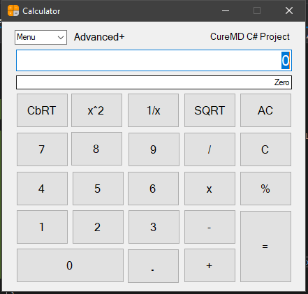

# Calculator App made in C#

**Note:** This is part of the assessment at CureMD retraining program for Electrical Engineers

## Summary

The project was made to test out the knowledge obtained during the learning phase of C# Language and to test and debug problems in that specfic environment. This App uses Windows Forms to create three layers of the Calculator App i.e Basic, Advanced & Advanced+. Special focus was given on implementing OOP principles like polymorphism etc.

### Basic Calculator

- The Basic Calculator looks like this:
  - 
- The functionality this can provide are
> - Addition
> - Multiplication
> - Division
> - Subtraction
> - Percentage
> - User input using both Interface Buttons and Keyboard Keys
> - Drop-down menu to go to different types of Calculator

### Advanced Calculator

- The Advanced Calculator looks like this:
  - 
- The functionality including all those of Basic Calculator and also
> - Square
> - Square Root
> - Inverse
> - Cube-Root

### Advanced+ Calculator

- The Advanced+ Calculator looks like this:
  - 
- The functionality including all those of Basic Calculator and Advanced Calculator and also
> - Number-to-Word Converter

#### Known Issues

- In any type of calculator, if user presses the "AC" **button** then proceed to write numbers and operators (like 9+8) using **Keyboard** and then press the Enter **Key**, it zeros out the result (though if user press "=" button it works correctly). The issue is because of ActiveControl which the last one was "AC". 

